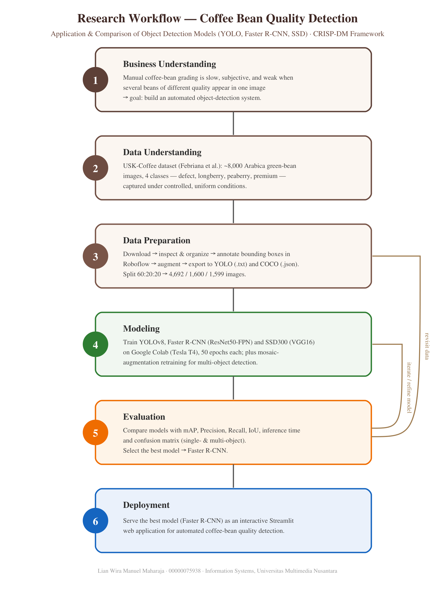
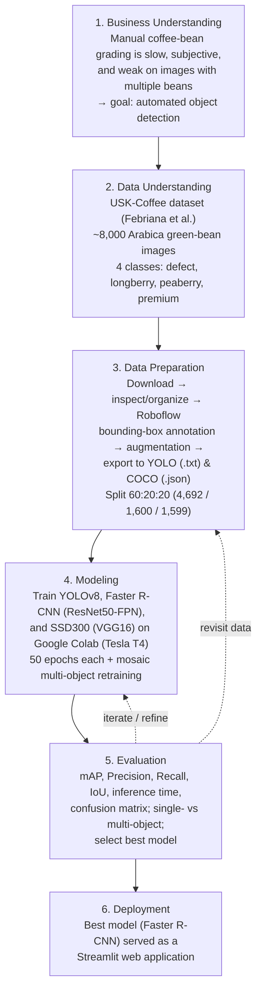
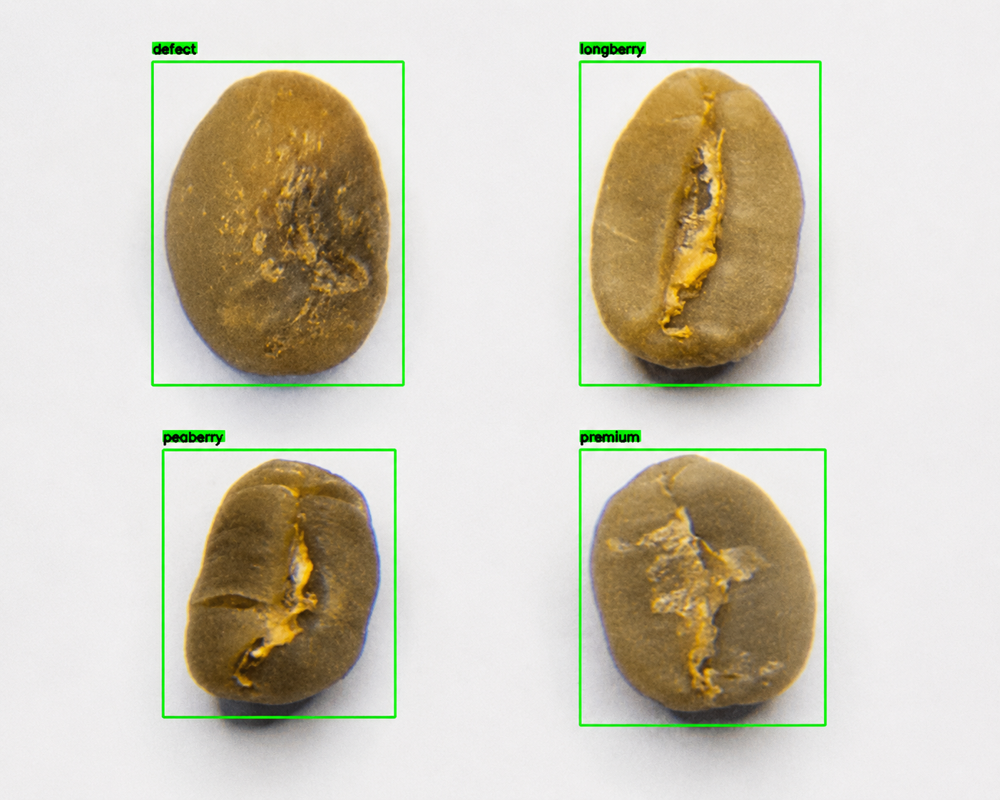
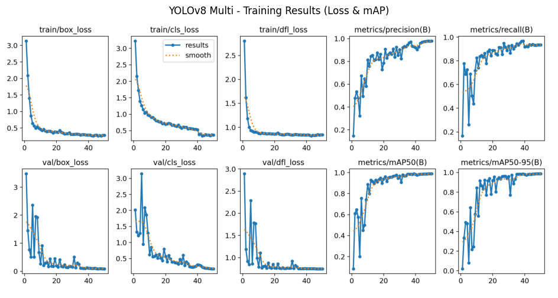
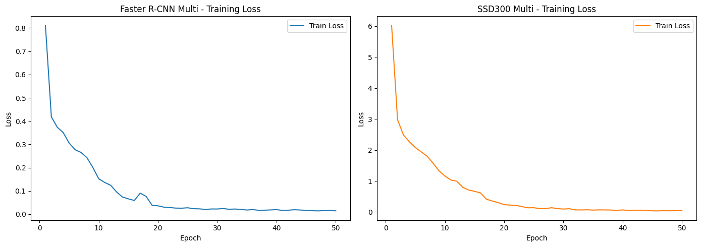
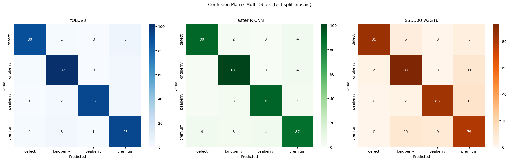
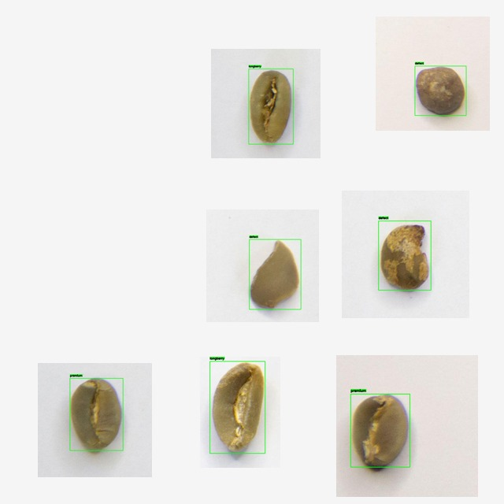

# Application and Comparison of Object Detection Models (YOLO, Faster R-CNN, SSD) for Coffee Bean Quality Detection

Official implementation of the undergraduate thesis
**"Penerapan dan Komparasi Model Objek Deteksi (YOLO, Faster R-CNN, SSD) untuk Deteksi Kualitas Biji Kopi"**
(*Application and Comparison of Object Detection Models for Coffee Bean Quality Detection*).

Information Systems Study Program, Universitas Multimedia Nusantara (UMN).

📄 **Paper / Thesis**: `<add your thesis or ResearchGate link here>`

---

## 📋 Overview

Coffee bean quality grading in industry is still largely performed **manually** through visual inspection by human experts. This process is time-consuming, highly subjective, and inconsistent between graders. In real conditions a single image can also contain **several beans of different quality**, which makes ordinary image *classification* insufficient.

This research develops and compares **object detection** models that can simultaneously **localize** (bounding box) and **classify** the quality of coffee beans in a single image. Three detectors are trained and compared:

- **YOLOv8** (one-stage, CSPDarknet backbone)
- **Faster R-CNN** (two-stage, ResNet50 + FPN backbone)
- **SSD300** (one-stage, VGG16 backbone)

The models are evaluated on the **USK-Coffee** dataset, which was originally an image-classification dataset and was extended in this research into an **object-detection dataset** through manual bounding-box annotation on Roboflow. The dataset covers **four quality classes**: `defect`, `longberry`, `peaberry`, and `premium`.

The methodology follows the **CRISP-DM** framework (Business Understanding → Data Understanding → Data Preparation → Modeling → Evaluation → Deployment). The best-performing model is deployed as an interactive **Streamlit** web application.

### Key Features

- **Multi-model comparison** of three representative object-detection architectures (one-stage vs. two-stage).
- **4-class coffee bean detection**: `defect`, `longberry`, `peaberry`, `premium`.
- **Single-object and multi-object detection** — models are additionally retrained on a **mosaic-augmentation** dataset to handle multiple beans per image.
- **Comprehensive evaluation** using mAP, Precision, Recall, IoU, per-class confusion matrix, and computational efficiency (inference time / FPS).
- **Interactive deployment** — a Streamlit web app lets users upload images, switch between models and detection modes (Single-Object / Multi-Object), and view detections with per-class bean counts.
- **Reproducible pipeline** — training and evaluation are fully documented in a Google Colab notebook.

---

## 🎯 Key Contributions

1. **Object-detection extension of USK-Coffee**: converting a coffee-bean *classification* dataset into an *object-detection* dataset through manual bounding-box annotation (Roboflow), exported to both **YOLO** (`.txt`) and **COCO** (`.json`) formats.
2. **Comparative benchmark** of YOLOv8, Faster R-CNN (ResNet50-FPN), and SSD300 (VGG16) on the same dataset and split, under identical training budgets (50 epochs).
3. **Multi-object dataset via mosaic augmentation** (300 composed images, 4–9 beans each) and warm-start retraining of all three models to evaluate multi-object performance.
4. **Critical performance analysis** — discussion of near-perfect metrics as an *upper bound* on a controlled dataset, including possible overfitting and near-duplicate data leakage, with recommendations for source-aware splitting and external testing.
5. **End-to-end deployment** — the best model (Faster R-CNN) integrated into a Streamlit application for automated coffee-bean quality detection.

---

## 🏗️ Project Architecture / Research Workflow

The research follows the **CRISP-DM** methodology. The framework diagram (in English) is shown below — vector source: [`research_workflow.svg`](research_workflow.svg).

<p align="center">
  
</p>

<p align="center"><em>Figure 1. Research workflow based on the CRISP-DM framework.</em></p>

The same workflow is shown below as a flowchart (renders automatically on GitHub):



---

## 🚀 Installation

### Requirements

- Python 3.9+
- PyTorch 2.x and Torchvision (matching CUDA build)
- Ultralytics (YOLOv8)
- Streamlit (for the web app)
- OpenCV, Pillow, NumPy
- (training/evaluation) Matplotlib, Seaborn, scikit-learn, timm
- A CUDA-capable GPU is recommended for training (this research used **Google Colab** with an **NVIDIA Tesla T4**).

All dependencies are listed in [`requirements.txt`](requirements.txt).

### Setup

1. Clone / download the project:
```bash
git clone <repository-url>
cd "coffee-bean-quality-detection"
```

2. (Optional) create a virtual environment:
```bash
conda create -n coffee python=3.10
conda activate coffee
```

3. Install dependencies:
```bash
pip install -r requirements.txt
```

4. Run the web application:
```bash
streamlit run app.py
```

> The app expects the trained model weights (`YoloV8.pt`, `fasterrcnn_resnet50_fpn.pth`, `model_ssd300_vgg16.pth`, and their `*_multi` counterparts) to be present in the same directory.

### Model Weights

The Faster R-CNN and SSD300 weight files (~96–165 MB each) exceed GitHub's file-size limit, so they are hosted on Google Drive together with the full project:

- **Trained weights & project (Google Drive)**: `<add your Drive link here — make sure the access is open>`

Download the weights and place them in the project root before running `app.py`.

---

## 📊 Dataset Preparation

### USK-Coffee (Object-Detection Version)

- **Base dataset**: USK-Coffee — Arabica green coffee-bean images introduced by *Febriana et al.* Originally an image-**classification** dataset (~8,000 images, 2,000 per class), captured under controlled lighting on a uniform background.
- **This research** extended it into an **object-detection** dataset by adding **manual bounding-box annotations** on **Roboflow**, then exported it to two formats:
  - **YOLOv8** (`.txt` labels + `data.yaml`) — for YOLOv8
  - **COCO** (`_annotations.coco.json`) — for Faster R-CNN and SSD300
- **Classes (4)**: `defect`, `longberry`, `peaberry`, `premium`
- **Preprocessing**: auto-orient + resize to **640×640**.
- **Effective data**: after export and validation, **7,891 images** with **7,334 valid bounding-box annotations** were usable (108 images were dropped because they had no valid annotation).

<p align="center">
  
</p>

<p align="center"><em>Figure 2. Sample images with bounding-box annotations for the four classes: defect, longberry, peaberry, premium.</em></p>

**Dataset split (60 : 20 : 20)**

| Subset | Images | Percentage |
|--------|-------:|-----------:|
| Training   | 4,692 | 59.46% |
| Validation | 1,600 | 20.28% |
| Testing    | 1,599 | 20.26% |
| **Total**  | **7,891** | **100%** |

**Annotations per class (bounding boxes)**

| Class | Train | Valid | Test | Total | % |
|-------|------:|------:|-----:|------:|----:|
| defect    | 1,171 | 401 | 400 | 1,972 | 26.89% |
| longberry | 1,200 | 399 | 400 | 1,999 | 27.26% |
| peaberry  |   761 | 400 | 399 | 1,560 | 21.27% |
| premium   | 1,003 | 400 | 400 | 1,803 | 24.58% |
| **Total** | **4,135** | **1,600** | **1,599** | **7,334** | **100%** |

**Multi-object (mosaic) dataset** — 300 composed images (4–9 beans each), split 60:20:20 into 180 / 60 / 60, used to retrain all three models for multi-object detection (1,958 annotations, imbalance ratio ≈ 1.07).

### Download

**Download links:**
- **Dataset (Roboflow / Drive)**: `<add your dataset link here — make sure the access is open>`

Once downloaded, organize the data as follows:

```
dataset/
├── data.yaml                       # YOLO config (paths + class names)
├── train/
│   ├── images/                     # .jpg images
│   └── labels/                     # YOLO .txt labels
├── valid/
│   ├── images/
│   └── labels/
├── test/
│   ├── images/
│   └── labels/
└── _annotations.coco.json          # COCO annotations (for Faster R-CNN & SSD)
```

---

## 🏋️ Training

All models were trained for **50 epochs** on the same 60:20:20 split (4,692 / 1,600 / 1,599 images) using **Google Colab** with an **NVIDIA Tesla T4** GPU. Ultralytics is used for YOLOv8; PyTorch + Torchvision for Faster R-CNN and SSD300.

**Training configuration (Table 4.5)**

| Parameter | YOLOv8 | Faster R-CNN | SSD300 VGG16 |
|-----------|--------|--------------|--------------|
| Backbone | CSPDarknet | ResNet50 + FPN | VGG16 |
| Annotation format | YOLO (`.txt`) | COCO (`.json`) | COCO (`.json`) |
| Epochs | 50 | 50 | 50 |
| Image size | 640 × 640 | 640 × 640 | 300 × 300 |
| Batch size | 16 | GPU-adjusted | GPU-adjusted |
| Optimizer | SGD (default) | SGD | Adam |
| Learning rate | default | 0.001 | 0.0001 |

Training loss and metric curves for the multi-object (mosaic) retraining are shown below; loss decreases steadily while mAP/precision/recall converge by the final epochs.

<p align="center">
  <br>
  <em>Figure 3. YOLOv8 (multi-object) training results — box/cls/dfl loss, precision, recall, mAP50, mAP50-95.</em>
</p>

<p align="center">
  <br>
  <em>Figure 4. Faster R-CNN (left) and SSD300 VGG16 (right) multi-object training-loss curves.</em>
</p>

**YOLOv8** (Ultralytics):
```python
from ultralytics import YOLO

model = YOLO("yolov8n.pt")          # pretrained init
model.train(
    data="data.yaml",
    epochs=50,
    imgsz=640,
    batch=16,
)
```

**Faster R-CNN / SSD300** (PyTorch + Torchvision), simplified:
```python
import torch
from torchvision.models.detection import fasterrcnn_resnet50_fpn, ssd300_vgg16

num_classes = 4 + 1                 # 4 classes + background
model = fasterrcnn_resnet50_fpn(num_classes=num_classes)   # or ssd300_vgg16(...)

optimizer = torch.optim.SGD(        # SSD300 uses Adam, lr=1e-4
    model.parameters(), lr=0.001, momentum=0.9, weight_decay=0.0005
)

for epoch in range(50):
    model.train()
    for images, targets in train_loader:
        loss_dict = model(images, targets)
        loss = sum(loss_dict.values())
        optimizer.zero_grad()
        loss.backward()
        optimizer.step()
```

The full, runnable training and evaluation pipeline is available in the notebook [`skrispsi2026.ipynb`](skrispsi2026.ipynb).

---

## 📊 Results

### Single-Object Comparison (Test set — 1,599 images)

*Table 4.7 — Model comparison. Inference time is the total time to process the 1,599 test images; FPS = images / inference time.*

| Model | mAP | Precision | Recall | IoU | Inference Time (s) | FPS |
|-------|----:|----------:|-------:|----:|-------------------:|----:|
| YOLOv8 | 91.57% | 85.74% | 88.77% | 84.32% | 92.78 | 17.23 |
| **Faster R-CNN (ResNet50-FPN)** | **99.97%** | **99.97%** | **100%** | **96.85%** | 1067.94 | 1.50 |
| SSD300 VGG16 | 98.11% | 100% | 98.92% | 92.41% | 17.59 | 90.88 |

### Multi-Object Comparison (Validation — mosaic dataset)

*Table 4.11 — Performance after retraining on the mosaic multi-object dataset.*

| Model | mAP | Precision | Recall | FPS |
|-------|----:|----------:|-------:|----:|
| **YOLOv8** | **97.10%** | 96.77% | 100% | 48.37 |
| Faster R-CNN | 95.85% | 96.53% | 100% | 29.15 |
| SSD300 VGG16 | 82.33% | 84.97% | 100% | 49.69 |

<p align="center">
  <br>
  <em>Figure 5. Per-class confusion matrices on the multi-object (mosaic) test split — YOLOv8, Faster R-CNN, SSD300 VGG16.</em>
</p>

<p align="center">
  <br>
  <em>Figure 6. Multi-object detection example — multiple coffee beans localized and classified in a single image.</em>
</p>

### Key Findings

- **Best overall model: Faster R-CNN (ResNet50-FPN)** — highest mAP, precision, recall, and IoU on single-object testing, and the most stable and precise detector on multi-object images (fewest overlapping boxes and misclassifications). It was selected for **deployment**. Trade-off: the slowest inference (two-stage detector, ~1.5 FPS).
- **SSD300 VGG16** — a strong accuracy/speed balance (98.11% mAP, 100% precision, ~90.9 FPS) and a near-perfect confusion matrix on single-object testing, but it produced some overlapping boxes on multi-object images.
- **YOLOv8** — fastest to train and competitive on multi-object detection (best multi-object mAP, 97.10%), but had the most class confusion on single-object testing (`peaberry`/`longberry` often predicted as `premium`).
- **Multi-object retraining** using mosaic augmentation substantially improved every model's ability to detect many beans in one image, addressing the limitation of the single-object models.
- **Critical note**: the very high metrics reflect a **controlled dataset** (uniform background, isolated objects, stable lighting) and should be read as an **upper bound**. Because all subsets come from the same source with a random split, near-duplicate **data leakage** cannot be fully ruled out. Future work should use source-aware splitting, cross-validation, and external field images.

Confusion matrices, training-loss curves, and qualitative detection samples are documented in the thesis (Chapter IV) and the notebook.

---

## 🏗️ Project Structure

```
.
├── app.py                          # Streamlit web app (deployment, best model = Faster R-CNN)
├── skrispsi2026.ipynb              # Training & evaluation notebook (Google Colab)
├── requirements.txt                # Python dependencies
├── README.md
├── research_workflow.svg           # Research framework diagram (CRISP-DM, English) — vector
├── research_workflow.png           # Research framework diagram — raster (for Drive/print)
├── assets/                         # Figures embedded in this README
│   ├── research_workflow.png       # Research framework (CRISP-DM)
│   ├── dataset_samples.png         # Four-class annotated samples
│   ├── training_yolo_multi.png     # YOLOv8 multi-object training curves
│   ├── training_frcnn_ssd_multi.png# Faster R-CNN & SSD300 training loss
│   ├── confusion_matrix_multi.png  # 3-model confusion matrix (multi-object)
│   └── detection_multi_object.jpg  # Multi-object detection example
│
├── YoloV8.pt                       # YOLOv8 weights   — single-object
├── YoloV8_multi.pt                 # YOLOv8 weights   — multi-object (mosaic)
├── fasterrcnn_resnet50_fpn.pth     # Faster R-CNN weights — single-object
├── fasterrcnn_multi.pth            # Faster R-CNN weights — multi-object
├── model_ssd300_vgg16.pth          # SSD300 VGG16 weights — single-object
├── ssd300_multi.pth                # SSD300 VGG16 weights — multi-object
│
├── Testing Skripsi Final/          # Sample test images (single & multi-object)
└── Gambar Penelitian Multi Objek/  # Multi-object detection result images
```

---

## 📝 Citation

If you find this work useful for your research, please cite:

```bibtex
@thesis{maharaja2025coffeebean,
  title        = {Penerapan dan Komparasi Model Objek Deteksi (YOLO, Faster R-CNN, SSD)
                  untuk Deteksi Kualitas Biji Kopi},
  author       = {Maharaja, Lian Wira Manuel},
  school       = {Universitas Multimedia Nusantara},
  year         = {2025},
  type         = {Undergraduate Thesis},
  address      = {Tangerang, Indonesia},
  note         = {Information Systems Study Program}
}
```

**Base dataset** — please also cite the original USK-Coffee dataset:

```bibtex
@article{febriana2022uskcoffee,
  title   = {USK-COFFEE Dataset: A Multi-class Green Arabica Coffee Bean Dataset for Deep Learning},
  author  = {Febriana, Ade and others},
  year    = {2022}
}
```

> Please verify and complete the citation details (authors, venue, year, DOI) before publishing.

---

## 🙏 Acknowledgments

- **Big Data Laboratory, Information Systems Study Program, Universitas Multimedia Nusantara (UMN)**.
- The authors of the **USK-Coffee** dataset (Febriana et al.) for providing the base coffee-bean images.
- Open-source tools used in this work: **Ultralytics YOLO**, **PyTorch / Torchvision**, **Roboflow**, **OpenCV**, and **Streamlit**.

---

## 📧 Contact

- **Author**: Lian Wira Manuel Maharaja (Student ID: 00000075938)
- **Program**: Information Systems, Universitas Multimedia Nusantara
- **Email**: `<lian.wira@student.umn.ac.id>`
- For questions or issues, please open an issue on the repository.

---

## 📜 License

This project is released for academic and educational purposes. Add a license (e.g. MIT) in a `LICENSE` file if you wish to specify usage terms.
